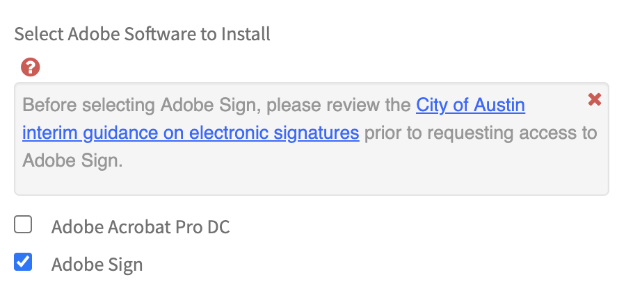

# Access CTM's electronic signature tool

CTM has implemented an electronic signature tool that is available for City departments to use. Departments are not required to use CTM's platform for electronic signatures. Those that have begun using a platform already can continue to do so, along with reviewing the guidance on this site.

### How to request the electronic signature tool

#### 1. Make sure you have read this guidance and understand what type of electronic signatures you need for your transactions.

If you have additional questions about the guidance, [contact our team](https://bit.ly/esignature-questions%20). 

#### 2. Submit a [request to the CTM Service Desk](https://atx.service-now.com/sp?id=sc_cat_item&sys_id=8d7002addbc74810e2f1121d139619cd&sysparm_category=4cd27231dbae3b805b03f482ba961906). 

Request access to the electronic signature tool with a [ticket to the CTM Service Desk](https://atx.service-now.com/sp?id=sc_cat_item&sys_id=8d7002addbc74810e2f1121d139619cd&sysparm_category=4cd27231dbae3b805b03f482ba961906). Check the box next to "Adobe Sign".

What to expect when you submit a request:

* **Cost**: You will need to provide your funding code \(FDU\) as part of the request. CTM's subscription to Adobe Sign includes a set number of transactions \(i.e., documents that are sent for signature\) already paid for. These no-cost transactions are available to departments first-come-first-served. Any transactions over the ceiling will cost $1.10 each. The CTM Service Desk will collect the FDU to ensure there is a funding source for transactions beyond what CTM has already procured.
* **Manager approval**: The CTM Service Desk will request manager approval for purchase \(even though this is likely no-cost for your department\). 

#### 3. Once approved, the CTM Service Desk will follow up to share instructions to activate your account. 

The platform uses single sign-on \(i.e., your network credentials\), so there is no need to create a new account. 

